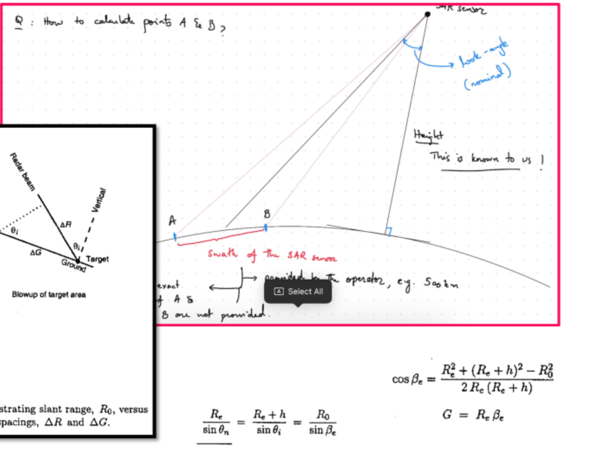

- [Abstract](#abstract)
- [Introduction](#introduction)
- [Literature Review](#literature-review)
  - [The Need for Updated Analysis](#the-need-for-updated-analysis)
  - [Counterspace: The First Key Variable](#counterspace-the-first-key-variable)
- [Modeling Chinese Earth-Observation Satellites](#modeling-chinese-earth-observation-satellites)
- [Shipwatch: Simulating Chinese Earth Observation Satellites](#shipwatch-simulating-chinese-earth-observation-satellites)
- [Results](#results)
  - [Sensitivity Analysis](#sensitivity-analysis)
    - [What Percentage of Chinese Earth Observation Satellites are Active on this Mission?](#what-percentage-of-chinese-earth-observation-satellites-are-active-on-this-mission)
    - [How Likely is it that a Follow-on Optical or SAR Satellite will Successfully Identify a Detected Ship?](#how-likely-is-it-that-a-follow-on-optical-or-sar-satellite-will-successfully-identify-a-detected-ship)
- [Conclusion](#conclusion)
- [References](#references)

# Abstract

How effective would Chinese satellite reconnaissance be in providing offboard cueing to attack U.S. surface ships during a war? How much could counter-space intervention by the United States reduce risk? These questions are important because they inform us about the plausible course of events in a Sino-U.S. war, determining the stability of the international system and shaping U.S. force structure. Unfortunately, most analyses of China's ability to gain offboard cueing on U.S. surface ships via satellites is based on projections made before the substantial expansion of China's satellite constellations in the past decade. To rectify this shortfall with contemporary information and at high fidelity, we designed a simulation of Chinese earth-observation satellites and tested it under a range of scenarios. We find that most U.S. ships would likely be detected and identified within an hour within the second island chain. We also find that 75% of Chinese earth-observation satellites would have to be eliminated in order to reduce the median time to identification to a day (22.7 $\pm$ 3.7 hours), which is otherwise estimated to be 5.9 $\pm$ 0.5 hours with all satellites functioning (and assuming a 2 hours of lag between the first tip generated and subsequent identification by an imaging satellite). This implies 1) that U.S. surface ships will be reliably detected and identified during a war with China, and 2) that there would be high escalatory pressure on the United States to initiate extensive counterspace actions.

# Introduction

The performance of the U.S. military during a war with China is a key driver of U.S. military force structure, the prospects for deterring a Chinese attack on Taiwan, and the stability of the international system as a whole. If China believes that the United States could not credibly defend Taiwan, China might launch an attack, leading to the first direct conflict between great powers since 1945. Therefore, the defense of Taiwan holds centerstage in U.S. military planning. A Biden administration declared that, “The PRC is the Department’s pacing challenge and a Taiwan contingency is the pacing scenario.”^[([“Statement By Dr. Ely Ratner, Assistant Secretary of Defense for Indo-Pacific Security Affairs, Office of the Secretary of Defense”, 2021, p. 3](zotero://select/library/items/XAYWTNRU)) ([pdf](zotero://open-pdf/library/items/362EWA29?page=3&annotation=9ANBGTBD))] The importance of China was reiterated by the second Trump administration, Secretary of War Pete Hegesth declared that, "the threat China poses is real, and it could be imminent... If deterrence fails... we are prepared to do what the Department of Defense does best: to fight and win, decisively."^[Secretary of War Pete Hegseth, quoted in Olay, Matthew. “Hegseth Outlines U.S. Vision for Indo-Pacific, Addresses China Threat.” U.S. Department of War, May 30, 2025. https://www.war.gov/News/News-Stories/Article/Article/4202504/hegseth-outlines-us-vision-for-indo-pacific-addresses-china-threat/.] This scenario drives many U.S. force structure decision, from the importance of long-range missiles to the prospects of U.S. ground forces.^[For a broad perspective based on iterated wargames, see: Cancian, Mark F., Matthew Cancian, and Eric Heginbotham. The First Battle of the Next War: Wargaming a Chinese Invasion of Taiwan. Center for Strategic and International Studies, 2023.] In particular, the centrality of maritime operations -- both for China in moving amphibious forces to Taiwan for the United States projecting power to deny Chinese victory -- drives U.S. naval strategy.^[Giarra, Paul, Roncolato, and Bill Hamblet. “The War of 2026: Phase III Scenario.” U.S. Naval Institute, December 1, 2023. https://www.usni.org/magazines/proceedings/2023/december/war-2026-phase-iii-scenario.] Examination of Chinese anti-ship capabilities has led some scholars to argue that the United States Navy should deprioritize surface ships, a dramatic departure in U.S. force structure.^[For an early analysis, see: Montgomery, Evan Braden. 2014. "Contested Primacy in the Western Pacific: China's Rise and the Future of U.S. Power Projection." International Security 38(4): 115--149. https://doi.org/10.1162/ISEC_a_00160. For a more contemporary analysis that comes to the a similar conclusions, see: Vandenengel, Jeff. Questioning the Carrier: Opportunities in Fleet Design for the U. S. Navy. Naval Institute Press, 2023.]

Understanding China's ability to conduct offboard cueing, or the detection and identification of targets by non-firing platforms, against U.S. surface ships is central to understanding the military balance. Surface ships are not the only tools that the United States would use in a war; however, they are a critical element of the United State's historic ability to project power and have therefore been a key target of China's military development.^[For more on U.S. power projection and its importance since the end of the Cold War, see: Posen, Barry. “Command of the Commons: The Miltary Foundation of U.S. Hegemony.” International Security 28 (July 2003): 5–46. https://doi.org/10.1162/016228803322427965. For more on China's thinking about how to counter U.S. power projection abilities, see: Tangredi, Sam. Anti-Access Warfare: Countering Anti-Access and Area-Denial Strategies. Naval Institute Press, 2013. For an analysis of China's ability to target other means of U.S. power projection, see: Anderson, Nicholas D., and Daryl G. Press. “Access Denied? The Sino-American Contest for Military Primacy in Asia.” International Security 50, no. 1 (2025): 118–51. https://doi.org/10.1162/ISEC.a.7.] Caverley (2025) proposed a framework in which China must *find* a ship by getting a sense of its location, *fix* the ship by determining its location with sufficient accuracy to bring a weapon to bear, and *finish* the ship with an appropriate weapon.^[Caverley, Jonathan D. “So What? Reassessing the Military Implications of Chinese Control of Taiwan.” Texas National Security Review, June 20, 2025. https://tnsr.org/2025/06/so-what-reassessing-the-military-implications-of-chinese-control-of-taiwan/.] Finding and fixing a contact are important steps, which we aggregate into the concept of detection - defined as determining that there is a ship of some type in an area with sufficient precision to be targeted. However, to this we add the step of identification - determining that the detected ship is an enemy combatant with sufficient confidence to launch an attack. With both detection and identification, China would then launch a strike to finish a U.S. surface ship.  Although China's expanding means of finishing U.S. surface ships have been the focus of much discussion, these capabilities rely more or less on offboard cueing for detection and identification. Thus, the U.S. Navy has emphasized dispersion of forces to make surface ships less likely to be detected and identified.^[The Navy's concept of Distributed Maritime Operations calls for dispersing Navy units "so as to make it harder for an adversary to detect and target Navy units". See: O’Rourke, Ronald. Defense Primer: Navy Distributed Maritime Operations (DMO) Concept. No. IF12599. Congressional Research Service, 2025. https://www.congress.gov/crs-product/IF12599; pg 1.] Similarly, scholars have focused on China's ability to gain offboard cueing against surface ships in examining the military balance and its implications.^[Green and Talmadge] 

Unfortunately, most of the analysis of China's ability to gain offboard cueing against surface ships builds on research that was conducted before a massive expansion in Chinese earth observation satellites. The key source is Heginbotham et al.'s 2015 analysis, which analyzed a 2017 scenario when they estimate China would have 9-12 earth observation satellites.^[Heginbotham, Eric, Michael Nixon, Forrest E. Morgan, Jacob L. Heim, Jeff Hagen, Sheng Tao Li, Jeffrey Engstrom, Martin C. Libicki, Paul DeLuca, David A. Shlapak, David R. Frelinger, Burgess Laird, Kyle Brady, and Lyle J. Morris. 2015. The U.S.-China Military Scorecard: Forces, Geography, and the Evolving Balance of Power, 1996–2017. RAND Corporation. https://www.rand.org/pubs/research_reports/RR392.html] However, to quote the Headquarters, Space Force Intelligence 2024 Space Threat Fact Sheet, "Since the end of 2015, China's on-orbit presence has grown by approximately 550% (+800 satellites). As of March 2024, China had more than 950 satellites in orbit."^[([Space Threat Fact Sheet[^SpaceThreatFact2024], 2024, p. 1](zotero://select/library/items/MY87VZPX)) ([pdf](zotero://open-pdf/library/items/J4FMF2XG?page=1))] Scholarship therefore needs a fresh analysis of China's ability to detect and identify U.S. surface ships. 

So, how effective would Chinese satellite reconnaissance be in providing offboard cueing to attack U.S. surface ships during a war? This leads to an obvious follow-on question: How much could counter-space intervention by the United States reduce risk? 

To answer these questions with more contemporary information at high fidelity, we designed a simulation of Chinese earth-observation satellites (Shipwatch) and tested it under a range of scenarios. Shipwatch tracks the orbits of 220 Chinese satellites, both commercial and government, using their Two-Line Element from Celestrak. Using a series of Python modules, it calculates their ability to detect ships at 11 relevant points in the Western Pacific. Once a ship is detected, it calculates the time delay until a subsequent satellite would be able to identify the ship. By running this simulation as a Monte Carlo simulation over the course of days, Shipwatch generates a plausible timeline for the detection and identification of ships in the Western Pacific that would be necessary to provide offboard cueing to China during a war. 

~~We find that most U.S. ships would likely be detected and identified within an hour within the second island chain.~~ Generalising our results over the 11 relevant points in the Western Pacific, we find that there is 50% probability that a U.S. ship will be successfully detected and identified within 5.9 ± 0.5 hours (including a 2 hour reaction time between a detection tip and a possible offboard cueing). It rises to 84.6% ± 0.045% by 12 hours, and further rises to 98.5% ± 0.009 by the end of 24 hours since the first detection. These results assume the ship is of an emitting class. Shipwatch also allows conducting the simulation over a range of scenarios, in which a random subset of the satellites are considered to be operational (for both detection and identification). If the number of operational satellites is reduced by a quarter, the probability of identification within 12 hours drops from 84.6% to 77.9%. We find that nearly 75% of Chinese earth-observation satellites would have to be eliminated in order to reduce the median time to identification to a day. Even if 90% of the satellites are eliminated, the probability that a U.S. surface ship is identified within 36 hours remains 57.4% ± 0.070%.

This implies 1) that U.S. surface ships will be reliably detected and identified during a war with China, and 2) that there would be high escalatory pressure on the United States to initiate extensive counterspace actions. If ships can be reliably detected and identified, the burden would be on U.S. ships to be able to defend themselves from Chinese attacks. Although the relative balance of offense and defense at sea is beyond the scope of this article, the U.S. Navy's increasing reliance on dispersal indicates that it is not confident that a clustered group of U.S. surface ships could defend itself once detected and identified. As (perhaps apocraphally) stated by Admiral Nelson: "A ship's a fool to fight a fort."^[Although Naval Doctrinal Publication 1 rightfully points out that Nelson frequently fought forts from ships. See: General Berger, David, Michael Admiral Gilday, and Karl Admiral Schultz. Naval Doctrinal Publication 1: Naval Warfare. 2020; pg. 56] To avoid U.S. ships fighting the fort of mainland China, extensive counterspace activities would be needed, and the risks of escalation that counterspace activities entail.^[Wan, Wilfred, and Nivedita Raju. "Escalation Risks at the Space-Nuclear Nexus". Stockholm International Peace Research Institute, 2024. https://doi.org/10.55163/FZDW6296.] Broadly, this means that either 1) analyses of China-U.S. conflicts should seriously discount the contributions of U.S. surface ships, or 2) assume that there will be an extensive and potentially escalatory counterspace campaign by the United States.

To support these findings we proceed in five steps:

1. Review the literature about Sino-U.S. conflict and how disagreements about both the effectiveness of and responses to Chinese earth-observation satellites have affected this debate.
2. Develop a model of Chinese earth-observation satellites based on open-source research and analogies to comparable civilian systems.
3. Develop a simulation that can employ this model to determine the detection timelines of U.S. ships at different locations and under different assumptions of the extent of U.S. counterspace efforts.
4. Use this simulation under a variety of assumptions about ship location and counterspace activities, finding that most U.S. ships would be detected and identified within an hour and that 75% of Chinese earth-observation satellites would have to be eliminated to reduce this time to a day.
5. Conclude with the implications of these findings for analysis of Sino-U.S. conflict, for counterspace warfare, and for U.S. military force structure.

# Literature Review

Although China has several weapons that can finish a U.S. surface ship, all benefit greatly from receiving offboard cueing to detect and identify their target.^[Discussing the efficacy of Chinese weapons to actually finish U.S. surface ship that have been detected and identified is beyond the scope of this article. For the purposes of this article, it is sufficient to assume that Chinese weapons have a significant chance of rendering U.S. surface ships not mission capable, and that these capabilities would aggregate up into significant operational effects. For a review of the literature on this subject, see Appendix B of O’Rourke, Ronald. China Naval Modernization: Implications for U.S. Navy Capabilities—Background and Issues for Congress. No. RL33153. Congressional Research Service, 2020; pg. 47-50] Most dependent on offboard cueing are Anti-Ship Ballistic Missiles (ASBMs). China's acquisition of ASBMs has been described as “the strategic equivalent of China’s acquiring nuclear weapons in 1964.”^[([Hagt and Durnin, 2009, p. 87](zotero://select/library/items/3DKHS34H)) ([pdf](zotero://open-pdf/library/items/4ZGQ5UH5?page=2))] However, ASBMs are not omnipotent. An ASBM has neither sufficient fuel, maneuverability, nor sensing ability to traverse the vastness of the Pacific Ocean looking for U.S. ships to strike.^[The DF-21 has been described as having a roughly 20 kilometer kill radius. 陈海东, 余梦伦, 辛万青, 李军辉, 曾庆湘  [Chen Haidong et al.], “再入飞行器攻击慢 速活动目标的制导方案研究” [Study for  the Guidance Scheme of Reentry Vehicles Attacking Slowly Moving Targets], 导弹与航天 运载技术 [Missiles and Space Vehicles], no. 6 (2000). Cited in Hagt and Drunin, 2009, pg. 92] It is furthermore doubtful, although theorectically possible, that an ASBM would possess sufficient sensor quality to positively identify that a ship is a warship (instead of a merchant or decoy of similar dimensions). ASBMs are therefore entirely dependent on offboard cueing. Other weapons less central to China's operational approach still benefit from offboard cueing, albeit to lesser extents. Anti-ship Cruise Missiles (ASCMs), the primary anti-surface weapon of ships and aircraft, have limited fields of regard like ASBMs. However, their launch platforms can provide some ability to "fix" a target (particularly if ASCMs are launched by aircraft), the true potential of ASCMs relies on offboard cueing. The U.S. government reports that China posseses cruise missiles with ranges greater than 1,500km, far behind the radar horizon of a ship or even an aircraft.^[Although it is unclear if these particular cruise missiles are anti-ship capable, the principle stands that China likely has anti-ship cruise missiles that benefit greatly from offboard cueing. Military and Security Developments Involving the People's Republic of China 2024. U.S. Department of Defense, 2024, p.166.] Even submarines benefit greatly from offboard cueing to position themselves for attack, given their slow transit speeds.^[Heginbotham et al., p. 192] It is possible that a submarine could organically detect a possible target at great distances, via the ship's noise passed through convergence zones or by the ship's electronic emissions. However, the submarine that launched its valuable ASCMs based on that information would be vulnerable to deception. For submarines, detection and identification from offboard cueing would ensure that precious endurance time and munitions were not wasted in wide area searches. The ability of China to provide offboard cueing to weapons therefore has significant operational effects for all Chinese anti-ship weapons.

However, traditional ISR methods struggle to provide reliable offboard cueing to detect and identify targets at the ranges required by China during a war with the United States. Chinese surface ships attempting to locate U.S. counterparts would have to operate hundreds or thousands of kilometers from the protective umbrella of the radars, surface-to-air missiles, aircraft, and logistical support of Chinese mainland. Aircraft and helicopters, they would still have to be far from the protective cover of the aircraft and surface-to-air missiles found on the Chinese mainland. Chinese aircraft would have many missions to perform in a conflict; conducting broad-area searches with short times on station 1,000+km from the Chinese coast alone could occupy the entire PLAAF. While High-Altitude Long-Endurance drones could overcome the problems of loiter times, they would be vulnerable to U.S. anti-air fires (whether generated from ship or aircraft). Chinese Over-The-Horizon-Backscatter (OTH-B) radar provides a possible solution, although with only two sites responsible for the entire U.S. ship operating area, it would be vulnerable to disruption, either by kinetic (long-range strike, for example by Tomahawk missiles) or non-kinetic (e.g., cyber) means. More exotic means, like hydrophones, have been posited, but these rely on unproven technologies and on a hypothetical future where China already occupies Taiwan.^[Green and Talmadge] Hagt and Drunin noted that Chinese confidence on this score was low in 2009, and likely for good reason.^[([Hagt and Durnin, 2009, p. 93](zotero://select/library/items/3DKHS34H)) ([pdf](zotero://open-pdf/library/items/4ZGQ5UH5?page=8))] However, realizing this weakness, Chinese efforts in this area have been extensive, primarily through its expansion of earth observation satellite constellations.

Therefore, satellite-based reconaissance is critical for enabling China's anti-ship strategy by detecting and identifying ships thousands of kilometers from the mainland. This buildup began in the late 2000s, with China's first space-based radar satellite launching only in 2006.^[For a discussion of the rationale for and development of China's early earth observation satellites, see: Hagt, Eric, and Matthew Durnin. “Space, China’s Tactical Frontier.” Journal of Strategic Studies 34, no. 5 (2011): 733–61. https://doi.org/10.1080/01402390.2011.610660.] Their position in orbit enables satellites to overcome the limitations that line of sight imposes on terrestrial sensors; that is, satellites even in low-earth orbit have the potential to detect and identify targets anywhere on the globe.^[For a discussion of how radar horizons limit terrestrial sensors, see: Biddle and Oelrich, 2016, pg. 23-25] Discussions of the military balance between the United States and China have therefore rightly seen satellite-based reconaissance by China as a key factor.

The best operational analysis of the ability of Chinese satellites to provide offboard cueing comes from Heginbotham et al.'s detailed 2015 analysis. It goes through the capabilities of Chinese optical and SAR satellites, the number of satellites, the revisit times, and the size of the search areas.^[Heginbotham et al., "U.S.-China Military Scorecard," 150-165.] They use a variety of sources and factor in considerations ranging from weather to viewing angle. The farthest forward in time that they analyze is 2017, when they estimate China would have 9-12 earth observation satellites, leading to an estimate of a 2.9 day median revisit time without cueing and a 2.6 hour with cueing.^[Heginbotham et al., "U.S.-China Military Scorecard," 162.] Heginbotham et al.'s analysis also assumes that the United States will be able to negate Chinese ISR with strikes on the mainland.^[Heginbotham et al., "U.S.-China Military Scorecard," 164.] Based on this analysis, they conclude that "Although Chinese satellite imaging capabilities are becoming more robust, large maritime search areas would nevertheless make it difficult for PLA commanders to locate targets using these satellites alone."^[Heginbotham et al., "U.S.-China Military Scorecard," 159-160.] Heginbotham et al. have influenced subsequent analyses, for example Green and Talmadge's analysis that Chinese over-the-horizon targeting is incapable of reliably locating U.S. surface ships unless China already holds Taiwan.^[Brendan Green and Caitlin Talmadge, "Then What? Assessing the Strategic Implications of Chinese Control of Taiwan," International Security 47, no. 1 (2022): 29.] 

However, other estimates with more satellites come up with more frequent imaging.^[For example, that 22 satellites would allow for imaging every 40 minutes. See: Solomon, Jonathan. “Defending the Fleet from China’s Anti-Ship Ballistic Missile : Naval Deception’s Roles in Sea-Based Missile Defense.” Georgetown University, 2011; pg. 14]. A 2016 French analysis similarly concludes that, even without electronics intelligence from satellites, that China could find contacts every day.^[clementM. “Les satellites chinois et la surveillance maritime.” East Pendulum, September 11, 2016. https://www.eastpendulum.com/les-satellites-chinois-et-la-surveillance-maritime. As of writing, the original site appears malformed. An English translation and archive can be found at: gosnold. “The Chinese Maritime Surveillance System.” SatelliteObservation.Net, September 20, 2016. https://satelliteobservation.net/2016/09/20/the-chinese-maritime-surveillance-system/.] This variability points to the need for an updated analysis based on China's evolving space order of battle.

## The Need for Updated Analysis

The probability and timeliness of offboard cueing directly correlates to the number of satellites in operation. As satellites are constantly moving while in orbit, multiple satellites are needed to ensure timely coverage of any given area.^[Geosynchronous satellites maintain their station relative to Earth, but their greater distance from Earth means that they require more advanced technologies to achieve the resolution of satellites in low-earth orbit. However, China has been working on this capability. We discuss how it is factored into our simulation below. See: Swope, Clayton. No Place to Hide: A Look into China’s Geosynchronous Surveillance Capabilities. January 19, 2024. https://www.csis.org/analysis/no-place-hide-look-chinas-geosynchronous-surveillance-capabilities.] This requirement for mass only increases as the areas of interest increase, as would be the case when looking for U.S. ships across the expanses of the Western Pacific. For this reason, the estimates of Chinese earth observation satellite revist rates vary significantly based on their estimates of the Chinese space order of battle. Some recent analyses of satellite reconnaisance exist, but are focused on non-military contexts.^[Saadia M. Pekkanen, John Ravenhill, and Rosemary Foot, Oxford Handbook of the International Relations of Asia (Oxford: Oxford University Press, 2022).] 

China has embarked on a massive buildup of earth observation satellites in the previous decade. Although China lagged significantly behind the United States a decade ago, when Heginbotham et al. conducted their analysis, “China is a near peer or peer in military remote sensing, creating new and enhanced operational planning dilemmas”^[([Nurkin et al., 2024, p. 6](zotero://select/library/items/J57JACAM)) ([pdf](zotero://open-pdf/library/items/43RSYQP6?page=6))]. China now operates over 300 remote sensing satellites capable of military detection.^[([“Competing in Space: Second Edition”, 2023, pp. 10-11](zotero://select/library/items/VWQ2DLFK)) ([pdf](zotero://open-pdf/library/items/MAFPMMMS?page=6))]. These would be used to target U.S. forces during a Taiwan contingency.^["China is building a massive architecture of remote-sensing satellites to help target U.S. forces if they move to defend Taiwan in a conflict", according to Maj. Gen. Greg Gagnon, deputy chief of space operations for intelligence. Cited in: Decker, Audrey. “Chinese Satellites Are Breaking the US ‘monopoly’ on Long-Range Targeting.” Defense One, May 2, 2024. https://www.defenseone.com/threats/2024/05/new-chinese-satellites-ending-us-monopoly-ability-track-and-hit-long-distance-targets/396272/.]

The proliferation of Chinese satellites furthermore calls into question some of the assumptions underlying Heginbotham et al.'s analysis. First, they posit that with accurate prediction of Chinese satellite orbits, U.S. Navy surface ships can plan their routes to avoid detection.^[Heginbotham et al., "U.S.-China Military Scorecard," 164.] Yet this opportunity also is closed off with the proliferation of satellites, particularly if it is unclear which of them are assigned to maritime search. They similarly posit that over-the-horizon radars (and presumably satellite control stations) are "well within the range of Tomahawk cruise missiles."^[Heginbotham et al., "U.S.-China Military Scorecard," 164.] This possibility too has diminished as the range of Chinese anti-ship missiles - and the ability of satellites to provide offboard cueing - has expanded. 

## Counterspace: The First Key Variable

Counterspace, or capabilities that can be used to deceive, disrupt, deny, degrade, or destroy space systems, must be taken into account for any analysis of space warfare.^[Definition taken from: Victoria Samson, Global Counterspace Capabilities: An Open Source Assessment (Washington, D.C.: Secure World Foundation, 2025), xviii.] Counterspace capabilities can be categorized along a continuum from reversible (soft-kill) to nonreversible (hard-kill) effects ^[For an overview, see: Challenges to Security in Space: Space Reliance in an Era of Competition and Expansion. [Second edition]. Defense Intelligence Agency, 2022; pg. 44-47]. Hard-kill weapons are kinetic weapons using physical means that collide with a satellite to physically destroy it. These include both direct-ascent missiles launched from Earth or projectiles fired from other satellites. Soft-kill capabilities, in contrast, rely on non-kinetic or electronic means to achieve reversible, nondestructive, and temporary effects, allowing the system to resume normal operations after the incident. Soft-kill attacks include Electronic Warfare (EW) like radiofrequency jammers and spoofing, Directed Energy Weapons (DEW) such as lasers that can "dazzle" or blind observation satellites in the visible and infrared ranges, and cyber attacks that disrupt data, interfere with satellite operations, or exploit vulnerabilities in the supply chain or ground infrastructure. Given the variety of means available for counterspace operations, analysts have understandably factored them into their calculations about Chinese space-based ISR, albeit to varying degrees.

At one extreme is Biddle and Oelrich (2016), whose analysis of future warfare in East Asia was scoped to conflicts in which all satellites are destroyed at the outset of the conflict.^[Stephen Biddle and Ivan Oelrich, "Future Warfare in the Western Pacific: Chinese Antiaccess/Area Denial, U.S. AirSea Battle, and Command of the Commons in East Asia," International Security 41 (2016): 7-48, https://doi.org/10.1162/ISEC_a_00249.] They posit that for earth observation satellites, "defense is impractical in the long term if a sophisticated enemy is willing to attack them."^[Biddle and Oelrich, "Future Warfare in the Western Pacific," 25.] There are three key caveats. In the case of the United States and China, they both satisfy the condition of being "sophisticated". Second, the fight must be over the "long term", a term that is not specified. This condition might be ignored, as it could be imagined that direct ascent anti-satellite weapons can presumably be built before conflict and deployed within days of outbreak. Finally, given the scope of the conflict, it could be posited that both sides are willing to use all weapons available to them. China might be particularly willing to escalate to mass use of direct-ascent weapons if they believed that the United States held a distinct advantage in that domain.^[Wang, Howard, Jackson Smith, and Cristina L. Garafola. Chinese Military Views of Low Earth Orbit: Proliferation, Starlink, and Desired Countermeasures. 2025. https://www.rand.org/pubs/research_reports/RRA3139-1.html.]

However, there are reasons to doubt that the conditions that underpin Biddle and Oelrich's conclusion might not obtain to most future conflicts between the United States and China.

First, both sides might exhibit mutual deterrence and be unwilling to resort to direct ascent atttacks that would be needed to ensure that the other side's satellite ISR is crippled. The use of direct ascent weapons poses threats to one's own satellites, not just from the risk of retaliation by the adversary, but also from space debris. The debris from the destruction of only one of the other side's satellites might only disable one or two active satellites per year, but the risks increase exponentially as more satellites are destroyed, with the ultimate risk that a chain reaction could cause all of LEO to be unusable by both sides.^[Discussed in Oelrich, Ivan, Paul van Hooft, and Stephen Biddle. “Anti-Satellite Warfare, Proliferated Satellites, and the Future of Space-Based Military Surveillance.” Journal of Strategic Studies 47, nos. 6–7 (2024): 916–38. https://doi.org/10.1080/01402390.2024.2379398: pg. 924-925] Realizing their own dependence on satellites, China has shifted its emphasis in counterspace capabilities towards reversible, non-kinetic attacks.^[Berge, Jonas Vidhammer, and Henrik Stålhane Hiim. “Killing Them Softly: China’s Counterspace Developments and Force Posture in Space.” Journal of Strategic Studies 47, nos. 6–7 (2024): 940–63. https://doi.org/10.1080/01402390.2024.2388658.] U.S. analysts have cited this need for space escalation management as a reason why a variety of reversible and non-reversible counterspace systems are neeed.^[The Expansion of China’s Military Space and Counterspace Capabilities and Implications for Space as a Contested Domain: Hearing before the U.S.-China Economic and Security Review Commission, United States Congress (2025).] Indeed, a series of wargames found that payers were largely deterred from using direct-ascent weapons due to concerns about retaliation against their own satellites.^[Cancian et al., 2023, pg. 115] A conflict between the United States and China might therefore see mutual deterrence and the continued operation of satellite reconnaisance.

Second, the rise of proliferated LEO might make it impossible for even sophisticated adversaries to destroy each other's ISR satellites. Decreasing launch costs and increasing minituarization have enabled the number of satellites in LEO to increase exponentially in the past decade. Recognizing this change, a more recent article by Biddle and Oelrich argues that ground-based dazzling and jamming will be required by future militaries against proliferated satellites.^[Ivan Oelrich, Paul van Hooft, and Stephen Biddle, "Anti-Satellite Warfare, Proliferated Satellites, and the Future of Space-Based Military Surveillance," Journal of Strategic Studies (2024): 1-24, https://doi.org/10.1080/01402390.2024.2379398.] Although their analysis is focused on ground forcves, the same principle holds for providing offboard cueing for targeting surface ships. Burdette (2025) cites the proliferation of satellites in LEO as a key factor in his conclusion that building direct-ascent ASATs "would likely not be a cost-effective solution to the challenge that proliferated constellations create."^[Burdette, Zachary. “The U.S.-China Military Balance in Space.” International Security 49, no. 4 (2025): 71–118. https://doi.org/10.1162/isec_a_00509; pg. 109] Although his analysis is focused on the China's ability to disrupt U.S. satellite constellations, the results pertain to the reverse case that we consider here.^[Burdette, 2025; pg. 74]

Third, the individual vulnerability of satellites does not necessarily create operational level effects, particularly during the initial phases of a Taiwan invasion scenario. Despite frequent discussions of *fait accompli* attacks by China, the physical reality is that it would take weeks for China to move sufficient ground forces onto Taiwan to be victorious.^[For a discussion of how these logistical contraints affect political decisionmaking: Cancian, Matthew F. “States of Denial: Sensibly Defending Taiwan.” Survival 67, no. 2 (2025): 133–58. https://doi.org/10.1080/00396338.2025.2481778; pg. 143-145] Biddle and Oelrich's formulation stipulated that defense is impractical "in the long term", a theme that Burdette draws on in his analysis that counterspace capabilities do not automatically negate the operational effects of satellites.^[Burdette (2025) discusses this in turn for all counterspace capabilities from pg. 99-116] The physical limitations that would delay counterspace capabilities from manifesting into operational effects would be augmented by political delays. Both sides would ideally like to win at the lowest escalation level possible, inducing political leaders to delay authorities to conduct counterspace activites (particularly the most effective kinetic attacks). 

The literature on the U.S.-China balance therefore needs to be updated with a rigorous model of China's ability to provide offboard cueing to its weapon systems, while accounting for U.S. counterspace activity.

# Modeling Chinese Earth-Observation Satellites

Although there are many elements to the space battle in a U.S.-China conflict, this paper is scoped to focus solely on China's ability to gain offboard cueing via earth-observation satellites. Attacks on China's PNT can be scoped out because we can safely assume that these weapons are not reliant on PNT, instead relying on terminal guidance to strike ships and INS to track location until they reach their seeker basket. Second, communications degradation from satellite destruction can be ignored because the weapons don't have to communicate back to the mainland once launched, and the kill web that orders weapon launch is entirely on the Chinese mainland and operating off of faster, more secure fiber optic cables. With a more restricted scope, this paper is thus free to dive into the necessary details for an operational analysis of China's ability to provide offboard cueing against U.S. surface ships using satellites.

To provide offboard cueing sufficient to justify the expenditure of limited weapons, satellites need not only to conduct detection - defined as determining that there is a ship of some type in an area with sufficient precision to be targeted - but must also provide identification - determining that the detected ship is an enemy combatant with sufficient confidence to launch an attack. Detection does not necessarily equal identification in this scenario for two reasons. First, although commercial traffic to Taiwan itself would cease during a war, there would still be many ships traveling to neutral countries (e.g., the Philippines, South Korea, Indonesia, etc.) in China's area of interest.^[For a discussion of merchant traffic during a Taiwan blockade scenario, see: Cancian, Mark F., Matthew F. Cancian, and Eric Heginbotham. Lights Out? Wargaming a Chinese Blockade of Taiwan. Center for Strategic and International Studies, 2025; pg. 54-55] China would not want to strike these neutral ships, both to conserve munitions and to avoid international censure. Second, the United States would likely try to deceive China by creating false targets that appear as U.S. surface ships. The previous Chief of Naval Operations designated "Leverage Deception" as one of his six overarching Force Design Imperatives.^[Admiral Gilday, Michael. Chief of Naval Operations: Navigation Plan 2022. n.d. Accessed October 21, 2025. https://media.defense.gov/2022/Jul/26/2003042389/-1/-1/1/NAVIGATION%20PLAN%202022_SIGNED.PDF; pg. 8] Although there are many forms of this decption, even something as low-tech as sailing unmanned or partially manned ships of a similar size to U.S. warships would complicate Chinese confidence in a potential strike. China therefore would have to leverage the different capabilities of its various satellites to detect surface ships and identify them as U.S. warships.

The three main classes of earth-observation satellites - Electro-Optical (EO), Synthetic Aperture Radar (SAR), and Electronic Intelligence (ELINT) all have different strengths and weakness for detection and identification.. 

EO satellites are best at target identification, but are weak at target detection. EO satellites function essentially as high-resolution digital cameras that use passive sensors to collect visible and infrared light reflected from objects on Earth. They typically provide high resolution of small areas, although they can be assigned to provide wide-area searches at lower resolutions.^[For a literature review, see: Kanjir, Urška, Harm Greidanus, and Krištof Oštir. “Vessel Detection and Classification from Spaceborne Optical Images: A Literature Survey.” Remote Sensing of Environment 207 (March 2018): 1–26. https://doi.org/10.1016/j.rse.2017.12.033.] EO satellites often detect ships via their wakes, rather than observation of the ship itself.^[Mazzeo, Andrea, Alfredo Renga, and Maria Daniela Graziano. “A Systematic Review of Ship Wake Detection Methods in Satellite Imagery.” Remote Sensing 16, no. 20 (2024): 3775. https://doi.org/10.3390/rs16203775.] EO satellites cannot image through cloud cover and can only see targets during daylight. They are also susceptible to directed energy weapons and dazzling.^[Samson, Victoria, and Laetitia Cesari. Global Counterspace Capabilities: An Open Source Assessment. Secure World Foundation, 2025. https://swfound.org/media/208089/swf_global_counterspace_capabilities_2025.pdf; pg. 03-22] 

SAR satellites can conduct both wide area detection and identification. SAR satellites are active sensors that transmit microwave signals to the Earth's surface and process the reflected returns to form high-resolution images. They can be set to either lower resolution, wide area (suitable for detection) or higher resolution, narrow area (suitable for identification).^[For a discussion of these capabilities in the Chinese literature, see: Huadong, Guo, Lian Dong, and Liu Guang. “Progress of Earth Observation in China.” Chinese Journal of Space Science 40, no. 5 (2022): 908–19. https://doi.org/10.11728/cjss2020.05.908; pg. 910] They are typically the preferred choice for detection of ship wakes. The wakes leave a high constrast in the radar backscatter compared the surrounding water facilitating the detection.^[For a detailed review on satellite methods for ship wake detection in satellite imagery, see: Mazzeo, Andrea, Alfredo Renga, and Maria Daniela Graziano. 2024. "A Systematic Review of Ship Wake Detection Methods in Satellite Imagery" Remote Sensing 16, no. 20: 3775. https://doi.org/10.3390/rs16203775] Their main advantages are that they can see through clouds and at night. However, their accuracy is affected by surface conditions.^[Although advances in machine learning are lessening the problems caused by sea state. See: Cao, Chenghui, Jie Zhang, Junmin Meng, Xi Zhang, and Xingpeng Mao. “Analysis of Ship Detection Performance with Full-, Compact- and Dual-Polarimetric SAR.” Remote Sensing 11, no. 18 (2019): 18. https://doi.org/10.3390/rs11182160.] SAR satellites can be jammed in two ways: either through deceptive jamming or barrage jamming (also called noise jamming). Deceptive jamming can create a false target, albeit one probably still within the seeker basket of an ASBM.^[One analysis of deceptive SAR jamming posited offsets of 100 meters from the false targets and true targets. See: Sun, Qingyang, Ting Shu, Bin Tang, and Wenxian Yu. “Target Deception Jamming Method against Spaceborne Synthetic Aperture Radar Using Electromagnetic Scattering.” Journal of Applied Remote Sensing 12, no. 1 (2018): 016033. https://doi.org/10.1117/1.JRS.12.016033.] Barrage jamming similarly covers only a small area; it therefore might prevent identification, but not detection.^[Guo, Zhengwei, Longyuan Wang, Zhenchang Liu, Zewen Fu, Ning Li, and Xuebo Zhang. “Adaptive Barrage Jamming Against SAR Based on Prior Information and Scene Segmentation.” Remote Sensing 17, no. 7 (2025): 1303. https://doi.org/10.3390/rs17071303.] China could attack the source of barrage jamming, but this would risk striking a low-value decoy jammer rather than a valuable target.

ELINT satellites offer the best possibilities for detection and identification, provided that the target is emitting in a military frequency. ELINT satellites utilize passive sensors to listen for electronic emissions, such as radar and radio transmissions from ships, over a wide area The radar emissions of military ships are different than those of civilian ships, being more powerful and operating at different frequencies than their civilian counterparts. Thus, the detection of a unique military radar by a satellite might promise to provide detection and identification over a broad area. However, there are two ways that the U.S. Navy could counteract these satellites. First, the U.S. Navy has indicated that it will try to keep its ships under strict "Emissions Control" during a war against China to minimize these signatures.^[The former CNO's Navigation Plan defined their Counter-C5ISRT effort as, "Continu[ing]to develop capabilities that support naval units operating inside adversary weapons engagement zones, focusing on full-spectrum sensing and signature management. Admiral Gilday, Michael. Chief of Naval Operations: Navigation Plan 2022. Accessed October 21, 2025. https://media.defense.gov/2022/Jul/26/2003042389/-1/-1/1/NAVIGATION%20PLAN%202022_SIGNED.PDF. Pg. 19] Second, even if the Chinese detect a unique military radar, it is possible that it is a decoy created by the U.S. for deception.

Given these capabilities and limitations, it is likely that the Chinese would want to positively identify a target with an EO or SAR satellite before committing to an attack. A SAR or ELINT detection can be fused with subsequent EO or SAR imagery to produce a positive identification.^[Zhang, Zenghui, Limeng Zhang, Juanping Wu, and Weiwei Guo. “Optical and Synthetic Aperture Radar Image Fusion for Ship Detection and Recognition: Current State, Challenges, and Future Prospects.” IEEE Geoscience and Remote Sensing Magazine 12, no. 4 (2024): 132–68. https://doi.org/10.1109/MGRS.2024.3404506.] A SAR identification could be blocked by barrage jamming, making it potentially less reliable than EO for identification. This will become an important element in sensitivity analysis.

Having established a basic framework - SIGINT satellites detect only emitting ships but require follow on identification, SAR satellites provide broad area detection against emitting and non-emitting ships, with identification possibly degraded by jamming, and EO satellites provide identification of contact detected by SAR and SIGINT - we can now describe the specifics of Shipwatch, our simulation of Chinese earth observation satellites. 

# Shipwatch: Simulating Chinese Earth Observation Satellites

To model the ability of China to conduct offboard cueing with satellites against U.S. surface ships during a war, we built a simulation called Shipwatch. Shipwatch is a Python-based program that models Chinese satellite orbits from open-source data. 

Shipwatch is capable of modeling 220 civilian and military Chinese satellites. Civilian satellites are included based on China's emphasis on military-civil fusion in space sensing^[Stokes et al., 2020, pg. 3]

Shipwatch only accounts for earth observation satellites in LEO. China has several satellites in geosynchronous orbit to conduct earth observation, including the most recently launched Yaogan-41.^[Space Threat Fact Sheet, 2024, p. 1; Swope, 2024]. These satellites appear to use EO and SAR. These satellites could not constantly image their field of regard due to energy constraints. Nevertheless, if they functioned as intended, they could dramatically shorten the time from detection to identification by providing satellites that constantly had ships in the Western Pacific within their field of view (vs. waiting until a LEO EO/SAR satellite with the correct orbit got into position to provide identification). We therefore assume that the United States would have to negate these satellites during the course of any campaign. Indeed, as poined out by Burdette, these GEO satellites are particularly vulnerable to jamming.^["Whereas uplink jammers can attack GEO satellites from wide areas because the satellites have a large footprint and effectively loiter in one spot, having a line of sight to satellites in LEO requires jammers to attack from within a much smaller, constantly shifting footprint." ([Burdette, 2025, p. 112](zotero://select/library/items/AU5SVEMT)) ([pdf](zotero://open-pdf/library/items/Y7GN9PRH?page=42))] Shipwatch therefore focuses solely on China's LEO earth observation satellites.

Each satellite has several specifications, based on open-source reporting and analogies to civilian satellites of the same era. Key sensor specifications include swath width, which defines the width of the ground area imaged in a single pass, and incidence angle, the angle at which the sensor views the surface. Resolution is another critical parameter that is inversely related to swatch width, indicating the smallest object or detail that can be distinguished by the sensor. Each of these specifications—sensor type, swath width, incidence angle, and resolution—make Shipwatch precise, but computationally expensive. Complete details are available in the technical appendix.

The duty cycle of each satellite, or when each satellite is active or charging is not tracked; rather, it is taken into account in a post-processing adjustment of the satellites that would be allocated to this mission. Calculations show that most LEO satellites would have sufficient battery to image either on their ascending or descending orbit, charging over the poles and on the opposite pass.Adnan's calculation of duty cycle 

Rather than looking at random points in the Pacific, we selected a few key representative points. By using fixed points, we can run Monte Carlo simulations to determine the distribution of detection timelines in those areas of interest. The points are as follows:

1. **Guam**
    - Latitude: 13.4443° N
    - Longitude: 144.7937° E
2. **Okinawa**
    - Latitude: 26.2124° N
    - Longitude: 127.6809° E
3. **Yonaguni**
    - Latitude: 24.4669° N
    - Longitude: 122.9832° E
4. **Itbayat**
    - Latitude: 20.7796° N
    - Longitude: 121.8311° E
5. **Kaohsiung**
    - Latitude: 22.6273° N
    - Longitude: 120.3014° E
6. **Taipei**
    - Latitude: 25.0330° N
    - Longitude: 121.5654° E
7. **Yokosuka**
    - Latitude: 35.2810° N
    - Longitude: 139.6674° E
8. **Point 1** (Northeastern part of Philippine Sea)
    - Latitude: 21.0000° N
    - Longitude: 134.0000° E
9. **Point 2** (Southeastern part of Philippine Sea)
    - Latitude: 14.0000° N
    - Longitude: 136.0000° E
10. **Point 3** (Southwestern part of Philippine Sea)
    - Latitude: 10.0000° N
    - Longitude: 128.0000° E
11. **Point 4** (Northwestern part of Philippine Sea)
    - Latitude: 17.0000° N
    - Longitude: 130.0000° E

The simulation proceeds through **one minute** intervals, determining which of those points are in the field of view for which satellites. If a site is in the field of view, and therefore a detection or identification is possible, Shipwatch calculates the angle $\theta$ for the satellite. The simulation continues through a **96 hour** period, recording the opportunities for detection and identification.

Taking the detection and identification opportunities produced by Shipwatch, we then use a postprocesser to calculate timelines to detection and identification timelines. This is when we can account for the variables of how many satellites are available for the offboard cueing mission, the timeline between detection and identification, and how likely a satellite is to identify a ship.

Post-simulation processing can alter which Chinese satellites are considered active, to take into account two factors would decrease the number of Chinese satellites that were available to detect U.S. surface ships: allocation to other missions, and the loss or degredation of satellites to U.S. counterspace missions. Many Chinese earth observation satellites would be allocated to missions other than providing offboard cueing to anti-ship attacks. As discussed above, LEO satellites are constantly moving in their orbits and have a limited duty cycle in which they can image. Some satellites would be allocated to imaging other important targets, whether they be in the region (e.g., U.S. airbases in Japan) or outside (e.g., military facilities in the continental United States). China's order of battle for this mission would further be reduced by U.S. counterspace efforts. Below, we examine different assumptions affect the timelines for detection and identification. However, our baseline assumption is that **50%** of Chinese earth-observation satellites in LEO would be active on this mission during a war against the U.S.

Post-simulation processing also factors in, but doesn't vary, the delay between when a satellite initially detects a ship and when a missile arrives at the target. This delay includes the time it takes for the satellite to send the image to a ground station, the time it takes for an analyst to review the image and identify the ship, the time it takes to send targeting information to the launch platform, and the time it takes for the missile to reach the target. ^[Heginbotham et al., "U.S.-China Military Scorecard," 163-164.] This delay can vary depending on several factors, including the location of the ship, the type of missile used, and the speed of communication between different components of the targeting system. For example, if a ship is located far from a Chinese military base or launch platform, it may take longer for a missile to reach it. Similarly, if there are delays in communication between the satellite, ground station, and launch platform, this can also increase the overall delay. In our simulation, we account for this delay using analogies to civilian satellite imagery downloads, analysis, and retasking. Our baseline assumption is that it would take China **90 minutes** to download, analyze, and give the order to retask a followo satellite for identification. These are not varied in the sensitivity analysis, but readers with different beliefs can simply add or subtract the difference from their timelines with the posited numbers.^[e.g., if our analysis concludes that there is a 25% chance that a ship would be identified in 2 hours, but a reader believes that the timeline to retasking would only be 60 minutes (30 minutes shorter than we assume), then the reader can infer that there is instead a 25% chance that a ship would be identified in 1.5 hours, and so on.]

Finally, post-simulation processing varies the chance that a satellite identifies a ship within its field of view. Satellite identification is not perfect; there is a robust literature about how to improve recognition using machine learning, but at plausible resolutions, there is likely a **60-80%** chance of identification.^[For a recent analysis of EO identification, a proposed algorithm achieved ~60% identification against ships 150m long (i.e., the length of an Arleigh Burke class Destroyer) and over 90% against ships 300m long (for comparison, a Gerald Ford class aircraft carrier is 333m). See: Heiselberg, Peder, Hasse Pedersen, Kristian Sørensen, and Henning Heiselberg. “Identification of Ships in Satellite Images.” IEEE Journal of Selected Topics in Applied Earth Observations and Remote Sensing PP (January 2024): 1–10. https://doi.org/10.1109/JSTARS.2024.3368508. Deep-learning algorithms have achieved greater than 90% accuracy in many papers. See: Li, Jianwei, Congan Xu, Hang Su, Long Gao, and Taoyang Wang. “Deep Learning for SAR Ship Detection: Past, Present and Future.” Remote Sensing 14, no. 11 (2022): 11. https://doi.org/10.3390/rs14112712.] As discussed above, EO satellites would fail to identify ships during night or through cloud cover. SAR satellites could fail due to jamming or during rainfall.^[One source estimates that 10% of the time in Taiwan there is rainfall of 40mm/day or more, which would occlude SAR detections. See: Wang, Chung-Chieh, Pi-Yu Chuang, Chih-Sheng Chang, Kazuhisa Tsuboki, Shin-Yi Huang, and Guo-Chen Leu. “Evaluation of Mei-Yu Heavy-Rainfall Quantitative Precipitation Forecasts in Taiwan by a Cloud-Resolving Model for Three Seasons of 2012–2014.” Natural Hazards and Earth System Sciences 22, no. 1 (2022): 23–40. https://doi.org/10.5194/nhess-22-23-2022.] Both could fail if the targeted ship maneuvered dramatically and was not in the identification satellites field of view. This would particularly be the case if there was a significant lag between the satellite pass that created a detection and a subsequent identification pass. However, to preview the findings somewhat, Chinese earth observation satellite revisit rates are sufficiently close together to make it unlikely that a detected ship could move outside of the area imaged by a follow-on satellite that was tasked with identification.^[A SAR satellite imaging at 5m resolution can cover an area of **size**, meaning that a ship would have to go **size/our average time to identification** to escape the imaged area.] Our base assumption is that [75%] of identification attempts will be successful.

# Results

## Sensitivity Analysis

We explore variation according to two variables that capture much uncertain information. First, what percentage of China's Earth Observation satellites are actively assigned to this mission at any one time, and second, how likely it is that a follow-on Optical or SAR satellite will successfully identify a detected ship.

### What Percentage of Chinese Earth Observation Satellites are Active on this Mission?

### How Likely is it that a Follow-on Optical or SAR Satellite will Successfully Identify a Detected Ship?

There is no guarantee that an optical or SAR satellite will be able to successfully identify a detected ship. 

The best algorithms get about 90%. 

However, this is based on the ships being in the frame. 

It is possible that the ship could have maneuvered erratically or be covered by clouds (for optical satellites). 

**Table 1:** _Simulation results for key representative points: Each entry in the table is the median time to possible identification of a US surface ship in case of a Sino-US conflict._

| Location \ Satellite Elimination | 90% | 75% | 50% | 25% | None (0%) |
|------|-----------------|-----------------|---------------|-----------------|--------------|
| **Guam** | 40.0 | 30.6 | 10.7 | 8.0 | 6.8 |
| **Okinawa** | 30.8 | 21.0 | 8.9 | 6.8 | 6.0 |
| **Yonaguni** | 20.4 | 16.0 | 6.9 | 5.8 | 5.1 |
| **Itbayat** | 32.6 | 21.6 | 8.4 | 7.2 | 6.2 |
| **Kaohsiung** | 25.6 | 20.5 | 7.7 | 6.5 | 5.7 |
| **Taipei** | 33.2 | 22.5 | 7.6 | 6.5 | 5.5 |
| **Yokosuka** | 15.6 | 12.2 | 5.5 | 4.5 | 4.2 |
| **Point-1** | 32.6 | 27.8 | 9.1 | 6.6 | 5.6 |
| **Point-2** | 31.1 | 24.4 | 9.9 | 7.4 | 6.5 |
| **Point-3** | 34.8 | 23.8 | 9.5 | 7.8 | 6.8 |
| **Point-4** | 37.6 | 29.1 | 9.3 | 7.9 | 6.6 |

**Table 2:** _Descriptive statistics across all key location: Each column is the percentage of the Chinese satellites considered eliminated under a counter space action by the US in case of a war conflict._

| Statistic | 90% | 75% | 50% | 25% | None (0%) |
|-----------|-----------------|-----------------|---------------|-----------------|--------------|
| **Sample Mean** | 30.0 | 21.8 | 8.4 | 6.8 | 6.0 |
| **Std. Deviation** | 6.9 | 5.6 | 1.5 | 1.1 | 0.9 |
| **Minimum** | 15.6 | 12.2 | 5.5 | 4.5 | 4.2 |
| **Maximum** | 40.0 | 30.6 | 10.7 | 8.0 | 6.8 |
| **Range** | 24.4 | 18.4 | 5.2 | 3.5 | 2.6 |

**Table 3:** _Confidence Intervals (95% confidence level): Data set used is as shown in Table 1, based on 11 key locations; the confidence intervals are calculated using t-distribution with n=11, α=0.05._

| % Elimination | Sample Mean | 95% CI Lower | 95% CI Upper | Margin of Error |
|-----------|------|--------------|--------------|-----------------|
| **90%** | 30.0 | 25.5 | 34.5 | 4.5 |
| **75%** | 21.8 | 18.1 | 25.5 | 3.7 |
| **50%** | 8.4 | 7.4 | 9.4 | 1.0 |
| **25%** | 6.8 | 6.1 | 7.5 | 0.7 |
| **None (0%)** | 6.0 | 5.4 | 6.6 | 0.6 |

---

**Note**: Data based on 11 cities (A through K). Confidence intervals calculated using t-distribution with n=11, α=0.05.

# Conclusion

These results cast doubt on how much any concept of operation can mitigate China's ability to gain offboard cueing if not accompanied by a substantial counterspace campaign. Scholars and Admirals have discussed how to use maneuver to mitigate China's ability to gain offboard cueing.^[The former U.S. Chief of Naval operations made "Counter-C5ISRT" [Command, Control, Computing, Communications, Cyber, Intelligence, Surveillance, Reconnaissance and Targeting] as one of his main efforts. See: Admiral Gilday, Michael. Chief of Naval Operations: Navigation Plan 2022. n.d. Accessed October 21, 2025. https://media.defense.gov/2022/Jul/26/2003042389/-1/-1/1/NAVIGATION%20PLAN%202022_SIGNED.PDF; pg. 19]

Carriers can still be useful for power projection below the level of great power war, or during war for missions that don't put them within range of Chinese missiles.^[Reilly, Sub-Lieutenant Joseph. “Long Live the Aircraft Carrier.” U.S. Naval Institute, January 1, 2025. https://www.usni.org/magazines/proceedings/2025/january/long-live-aircraft-carrier; Captain (Ret.) Tait, Scott. “It All Comes Down to Sea Control.” U.S. Naval Institute, December 1, 2023. https://www.usni.org/magazines/proceedings/2023/december/it-all-comes-down-sea-control.]

# References

